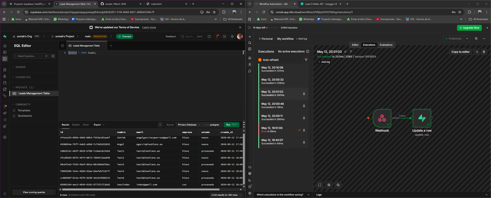

# Lead-O-Matic: Automatización de Prospectos

Este proyecto es una prueba de concepto (PoC) que integra tres tecnologías potentes para crear un sistema automático de captura y procesamiento de leads. El objetivo es demostrar cómo un backend moderno puede trabajar en conjunto con una base de datos distribuida y una herramienta de automatización low-code.

## El Stack Tecnológico

- **FastAPI (Python)**: Backend de alto rendimiento encargado de recibir las peticiones, validar los datos y actuar como puerta de enlace.
- **Supabase**: Plataforma Backend-as-a-Service (BaaS) que proporciona una base de datos PostgreSQL y gestiona los eventos mediante Webhooks.
- **n8n**: Motor de automatización de flujos de trabajo que procesa los datos en tiempo real y realiza acciones secundarias.

## ¿Cómo funciona? (El Flujo)

El proyecto sigue un diseño de arquitectura dirigida por eventos (Event-Driven):

1.  **Captura**: Un cliente (Frontend o API) envía los datos de un prospecto a un endpoint de **FastAPI**.
2.  **Persistencia**: FastAPI procesa la solicitud e inserta el registro en una tabla de **Supabase**.
3.  **Disparo (Webhook)**: Supabase detecta la inserción y dispara un **Database Webhook** hacia una URL específica.
4.  **Automatización**: **n8n** recibe el payload del webhook, ejecuta la lógica de negocio (por ejemplo, enriquecer datos o enviar notificaciones) y vuelve a conectar con Supabase para actualizar el estado del lead a `procesado`.

## Requisitos Previos

- Python 3.10+
- Cuenta en [Supabase](https://supabase.com/)
- Instancia de [n8n](https://n8n.io/) (Cloud)
- Variables de entorno configuradas en un archivo `.env`:
  - `SUPABASE_URL`
  - `SUPABASE_KEY`

## Instalación y Ejecución

Para preparar FastAPI:
pip install fastapi uvicorn supabase python-dotenv

Para lanzar main.py:
python -m uvicorn main:app --reload

# Conceptos Clave del Proyecto

## ¿Para qué sirve FastAPI?

**FastAPI** es un framework web de Python moderno y de alto rendimiento diseñado para construir APIs de forma rápida y eficiente. Sus casos de uso principales incluyen:

1.  **Microservicios de alto rendimiento**: Gracias a su soporte nativo para `async/await` (asincronía), puede manejar miles de peticiones simultáneas con una latencia mínima.
2.  **Validación de datos automática**: Utiliza **Pydantic** para asegurar que los datos que entran a tu sistema sean correctos. Si falta un campo o el formato es erróneo, FastAPI responde con un error claro automáticamente.
3.  **Documentación interactiva (Auto-docs)**: Genera automáticamente una interfaz (Swagger UI) en `/docs` que permite probar los endpoints sin necesidad de herramientas externas como Postman.
4.  **Procesamiento de Inteligencia Artificial**: Es el estándar actual para exponer modelos de Machine Learning (como los de OpenAI o Hugging Face) debido a su velocidad y facilidad para manejar datos JSON.

---

## ¿Qué es un Webhook?

Un **Webhook** es una forma en que una aplicación proporciona información a otra aplicación de manera **automática y en tiempo real**.

A diferencia de una API tradicional donde tú preguntas: _"¿Hay datos nuevos?"_ (Polling), un Webhook funciona bajo el principio de: _"No me llames, yo te llamo"_.

### Diferencia Visual:

- **API (Polling)**: Tu servidor le pregunta a la base de datos cada 5 minutos: "¿Hay leads nuevos?". (Gasto innecesario de recursos).
- **Webhook**: La base de datos (Supabase) le grita a tu servidor (n8n): "¡Ey! Acaba de entrar un lead nuevo, aquí tienes los datos". (Eficiencia total).

### ¿Cómo funciona en este proyecto?

1.  Ocurre un **Evento** en Supabase (Se inserta una fila en la tabla `leads`).
2.  Supabase busca la **URL de destino** que configuraste (la de n8n).
3.  Supabase envía una petición **HTTP POST** con los datos del lead a esa URL.
4.  n8n recibe el impacto y comienza a trabajar.

---

## ¿Por qué usamos ambos en este proyecto?

Usamos **FastAPI** para tener un punto de entrada controlado y seguro desde el mundo exterior, y usamos un **Webhook** para que la comunicación entre la base de datos y la automatización sea instantánea y eficiente, sin que nadie tenga que estar revisando manualmente si hay cambios.
